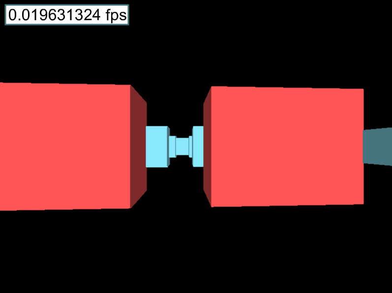
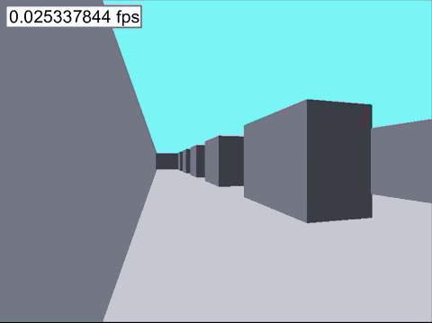

# Reprocessing Raycasting Example

This is a simple, untextured raycasting engine built with [Reprocessing](https://github.com/Schmavery/reprocessing) and [ReasonML](https://reasonml.github.io/)





### Sources/Bibliography

- [Lode's Computer Graphics Tutorial - Raycasting](https://lodev.org/cgtutor/raycasting.html)
- [Ray-Casting Tutorial For Game Development And Other Purposes by F. Permadi ](https://permadi.com/1996/05/ray-casting-tutorial-table-of-contents/)
- [A first-person engine in 265 lines by Hunter Loftis](http://www.playfuljs.com/a-first-person-engine-in-265-lines/)

(and Some Khan academy videos on Vector math)

### Install

```
yarn
```

### Build

```
yarn build
```

### Start

```
yarn start
```

To build to JS run `npm run build:web` and then run a static server, like `python -m SimpleHTTPServer` and go to `localhost:8000`. If you're using safari you can simply open the `index.html` and tick `Develop > Disable Cross-Origin Restrictions`.

To build to native run `npm run build:native` and run `npm run start:native`

The build system used is [bsb-native](https://github.com/bsansouci/bsb-native).

### Controls

You can use to arrow keys to navigate through the world.

### Changing the layout

If you want to change the change the map layout, you can do so by changing the values in the `worldMap array`. `0` means empty space, `1` is a wall.

Knock yourself out!
